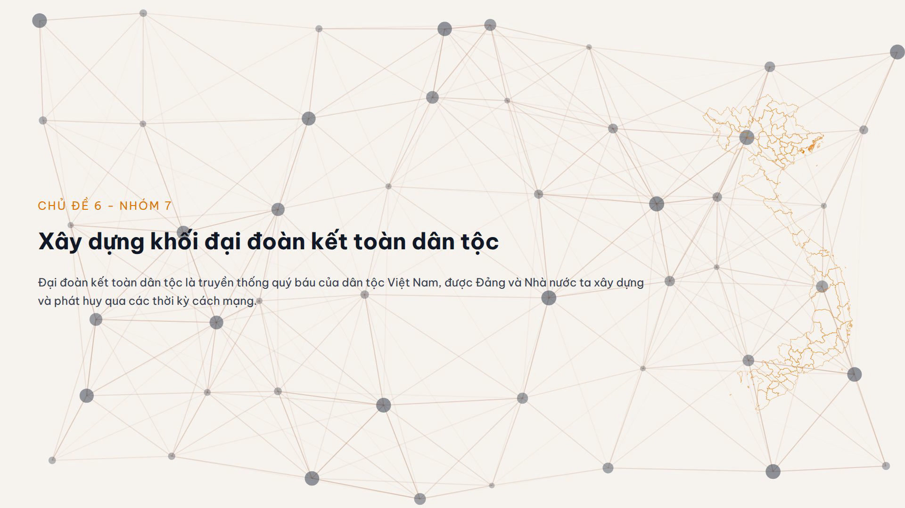
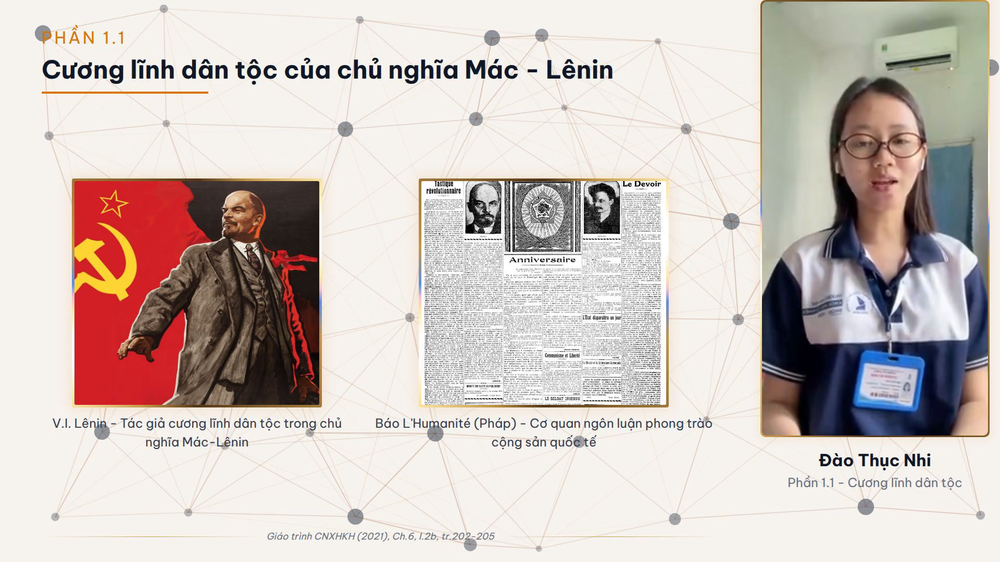
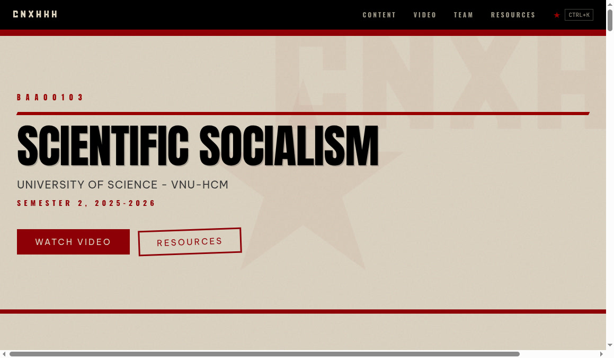
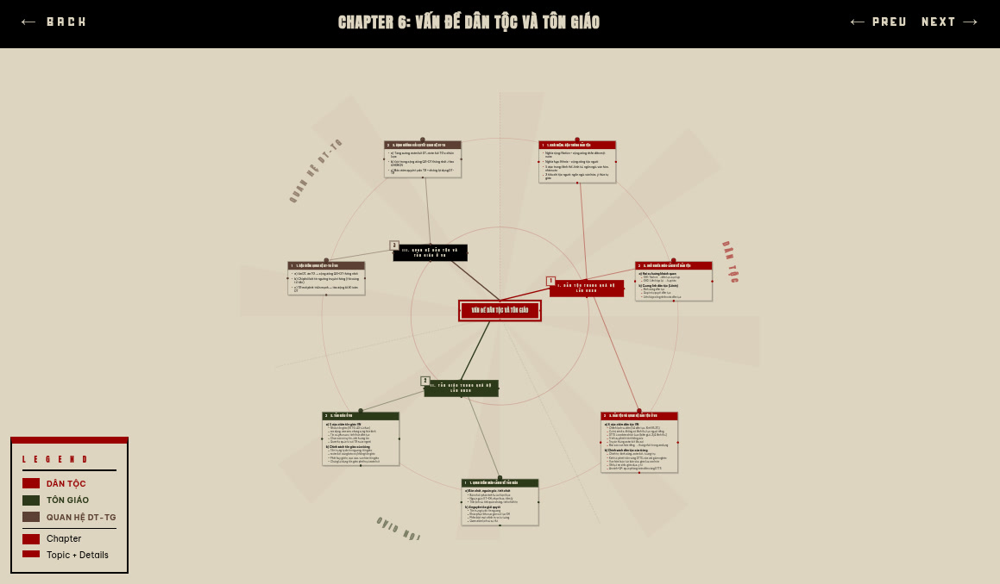

# CNXHKH - Nhóm 7

> Group presentation project for **BAA00103 - Chủ nghĩa xã hội khoa học** (Scientific Socialism), HCMUS Semester 2, 2025-2026.

**Topic:** Xây dựng khối đại đoàn kết toàn dân tộc (Building national unity)

**Live site:** [cnxhkh.fishcmus.io.vn](https://cnxhkh.fishcmus.io.vn) | **Video:** [YouTube](https://www.youtube.com/watch?v=GT7FYuN6Sc0)

---

This isn't a typical "upload slides and call it a day" university project. We built a full production pipeline: a programmatic video rendered from React components and a companion website with interactive mindmaps.

## Remotion Video (15 min, 1080p)

The entire video is code. No After Effects, no Premiere — just TypeScript. [Remotion](https://remotion.dev) turns React components into frames and renders them into a final MP4.





- **10 sections** with speech-synced card animations timed to member transcripts
- **15 design system components** — SectionTitle, FlowChart, BarChart, TypewriterText, MemberPiP, LowerThird, etc.
- **3D animated backgrounds** via `@remotion/three` (subtle mesh geometry behind content)
- **Member video compositing** — picture-in-picture with lower thirds, 11 source videos
- **EBU R128 audio normalization** across all member recordings
- **Light theme** — optimized for classroom projectors (dark backgrounds wash out when projected)

**Stack:** Remotion 4, React 19, TypeScript, Tailwind CSS, Three.js

## Landing Page

A companion website with a Soviet Propaganda design system — newsprint textures, stamp effects, constructivist layout, ALL CAPS everything. Because if you're studying Scientific Socialism, you might as well commit to the aesthetic.





- **Interactive mindmaps** — React Flow diagrams for all 7 textbook chapters, custom radial layout algorithm
- **Script viewer** — full presentation script with per-member attribution
- **Component gallery** — visual QA at `/gallery`

**Stack:** Next.js 15, React 19, Tailwind v4, shadcn/ui, React Flow

## My Contribution (Nhân - lead)

I designed and built the technical infrastructure for this project:

- Architected the **15-component design system** (develop in Ladle isolation → verify in gallery → integrate into sections)
- Built the **Remotion composition pipeline** — section sequencing, frame-accurate transcript sync (`frame = 360 + transcript_seconds * 30`), member video compositing
- Implemented the **radial mindmap layout algorithm** — weighted angular sectors proportional to leaf count, polar-to-cartesian conversion
- Designed the **Soviet Propaganda visual system** for the landing page — color palette, typography rules, texture layers
- Audio normalization, video proxy pipeline, Cloudflare Pages deployment
- Coordinated 8 team members' content submissions and script integration

Other members contributed their section scripts, self-recorded presentation videos, and research content.

## Numbers

| Metric | Count |
|--------|-------|
| Remotion components | 28 (15 DS + 13 sections) |
| Landing page components | 32 |
| TypeScript/TSX + CSS | ~9,400 lines across two apps |
| Video duration | 15:00 at 30fps (27,000 frames) |
| Member videos composited | 11 |
| Textbook chapters extracted | 7 (from scanned PDF via PyMuPDF + LLM) |

## Local Dev

```bash
git clone --recurse-submodules https://github.com/FISHcmus/science-socialism.git
cd science-socialism
git lfs pull

# Video studio — opens Remotion editor at localhost:3000
cd de_an_quay_video/remotion && bun install && bun run studio

# Landing page — dev server
cd landingpage && bun install && bun run dev
```

**Requires:** git-lfs, bun

## Team (Nhóm 7)

| Member | Role |
|--------|------|
| Nguyễn Hữu Thiện Nhân | Lead, video production, DS architecture, landing page |
| Đào Thục Nhi | Section 1.1 - Cương lĩnh dân tộc |
| Nguyễn Hồng Châu Nhi | Section 1.2 - Lãnh đạo dân tộc thiểu số |
| Trần Thị Phụng Nhi | Section 1.3 - Đại đoàn kết trong cách mạng |
| Bùi Huỳnh Nhi | Section 2.1 - Thực tiễn đoàn kết |
| Ngô Văn Phú | Section 2.2 - Chính sách dân tộc |
| Nguyễn Phạm Quỳnh Như | Section 3.1 - Trách nhiệm sinh viên |
| Hoàng Thị Tố Như | Section 3.2 - Vai trò thanh niên |
| Nguyễn Đình Ý Như | Section 3.3 - Giải pháp cụ thể |

## License

University coursework. Not licensed for redistribution.
